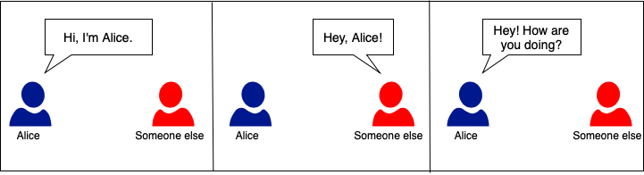

# NDN Tutorial

## Introduction

Welcome to the NDN Tutorial! We've prepared a set of exercises to help
you get started with NDN architecture, ndnSIM simulator, NDN-CXX/NFD 
APIs, and the overall NDN application development. The NDN tutorial is
organized into several modules:

1. NDN Helloworld
* [NDN-Helloworld](./exercises/1-ndn-helloworld)

2. Simple Producer/Consumer Application
* [NDN-Greetings](./exercises/2-ndn-greetings)

3. Secure NDN Applications
* [Signed NDN-Greetings](./exercises/3-signed-ndn-greetings)

## NDN-Greetings

Towards our NDN tutorial, we will provide examples and exercises based
on the *NDN-Greetings* application. The NDN-Greetings provides a simplified 
way of learning NDN application development through a workflow that mimics
the way we use English greetings. English has many greetings expressions
that can be used in formal and daily conversations.

A typical scenario where two people greet each other is:

Follow the modules on our tutorial to learn many other English Greetings,
and also learn more about NDN architecture, of course.

## Presentation and Textbook

The slides are available [online](https://www.sbrc2021.facom.ufu.br/pt-br/programacao/minicursos/mc2-revisitando-icns-mobilidade-seguranca-e-aplicacoes-distribuidas-atraves)
and the textbook for this tutorial (presented as a Short course at 
[SBRC 2021](https://www.sbrc2021.facom.ufu.br/)) is also available
[online](https://www.sbrc2021.facom.ufu.br/pt-br/programacao/minicursos/mc2-revisitando-icns-mobilidade-seguranca-e-aplicacoes-distribuidas-atraves).
 
## Execution Environment

If you are starting this tutorial from the Brazilian Symposium on Computer
Networks and Distributed Systems, then we've already provided you with a 
virtual machine that has all of the required software installed.

If you want to setup the environment by your self, you will need to either
build a virtual machine or install several dependencies.

To build the virtual machine:
- Install [Vagrant](https://vagrantup.com) and [VirtualBox](https://virtualbox.org)
- `cd vm`
- `vagrant up`
- When the machine reboots, you should have a graphical desktop machine with the required
software pre-installed.
- Log in with username `ndn` and password `ndn` and follow the instructions from the
Intruction

To install dependencies by hand, please reference the [vm](../vm) installation scripts.
They contain the dependencies, versions, and installation procedure. You can run them 
directly on an Debian Buster machine (it should also work on Ubuntu 18.04 or 20.04):
- `sudo ./bootstrap.sh`
