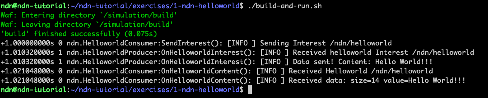
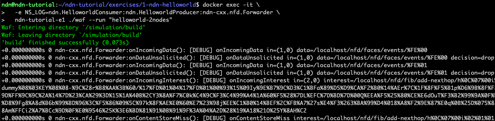
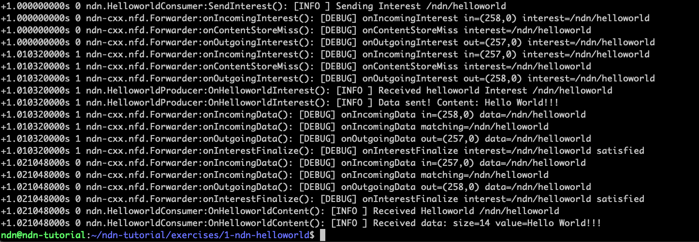
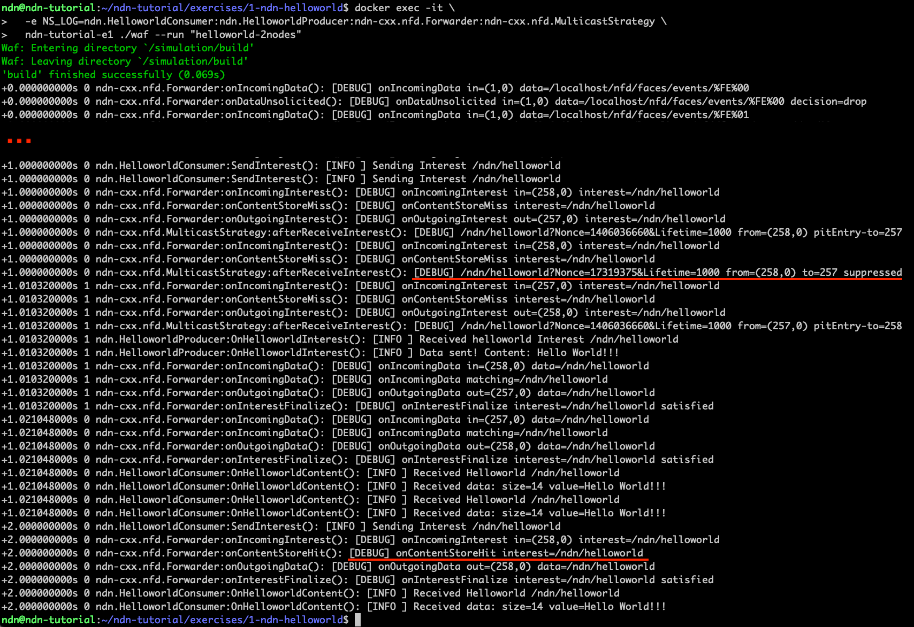
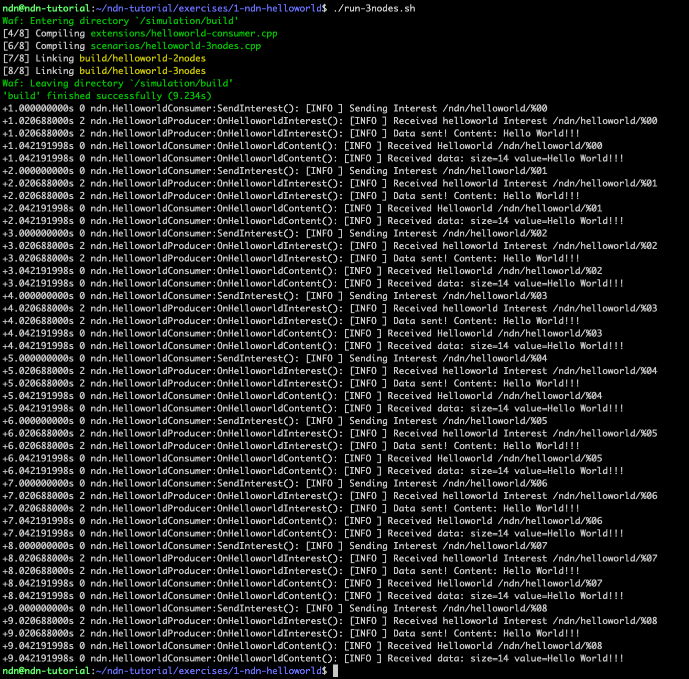
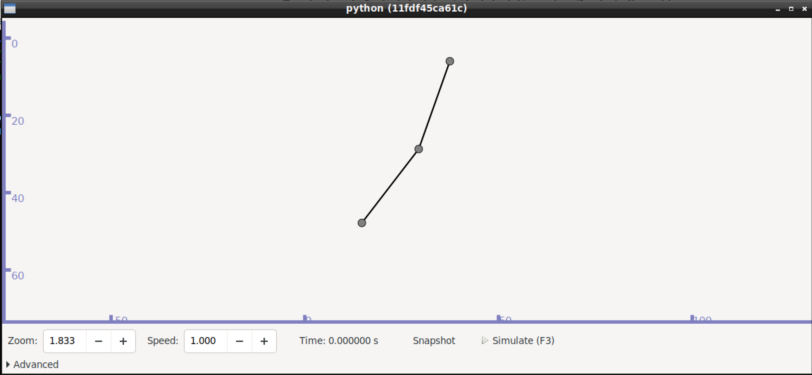
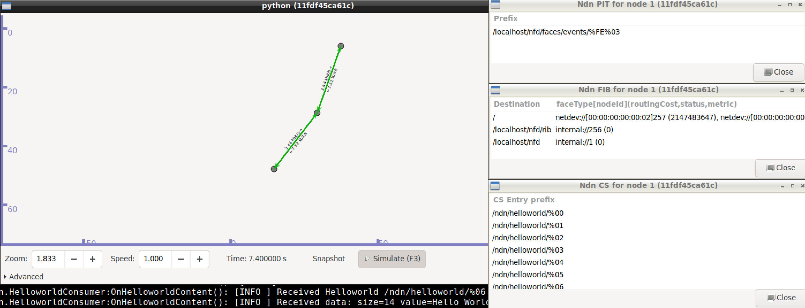

# NDN-Helloworld: A very simple NDN helloworld application

## Introduction

In this first exercise, we will build a very simple application that just
exchange interest / data packets do demonstrate the NDN architecture and
the ndn-cxx APIs. We provide two scenarios: the first one with just two
nodes, one producer and one consumer; the second one with the same app
but with three nodes, an additional forwarder. Through out the exercise
we will explore some of the NDN components, like the FIB, PIT and CS. In
the end, you will have the opportunity to also use the graphical visualizer
from ndnSIM, which is quite helpful to troubleshoot issues during the
development of a new application.

Let's get started!

> **Spoiler alert:** There is a reference solution in the `solution`
> sub-directory. Feel free to compare your implementation to the
> reference.

## Part 1: Creating and running the basic helloworld ndn app

0. In your shell, make sure you are at the exercise folder:
   ```bash
   cd ~/ndn-tutorial/exercises/1-ndn-helloworld
   ```

1. To start developing our application we will create a specific repository
   to write our simulation scenarios and application code. This is actually
   the recommmended way of writing simulation scenarios for ndnSIM. To do
   so, let's use the following template repository:
   ```bash
   git clone https://github.com/named-data-ndnSIM/scenario-template.git ndn-helloworld
   sed -i "s/'-pedantic'/#'-pedantic'/g" ndn-helloworld/.waf-tools/default-compiler-flags.py
   ```
   Once you clone the template repository, you will have the following files/folders:
   - `README.md`: This is a README documentation of the application. You should change
      it accordingly;
   - `extensions/`: This is the most important folder, where all code you create for
      the application should be placed
   - `scenarios/`: this is also an important directory because it is used to define
      the scenarios where your application will be running. NS-3 and ndnSIM have a
      well defined separation on the application code and the scenario, i.e. the 
      environment being simulated (a wifi scenario, point-to-point, different
      topologies, etc).
   - `waf`, `wscript` and `.waf-tools/`: those are files/directories related to the
     waf build system. You rarely have to change something here, unless you really
     want to customize some build parameters or something. In the sequence of
     commands above, for instance, we changed one of the the compilation parameters.
   - `run.py`, `graphs/` and `results/` contains a set of helpful scripts for
     large scale simulations and analyzes.
   The template repository comes without any application/scenario. In the next steps
   we will create a simple scenario and the helloworld application.

2. Once we have our repository ready, let's create a docker container to run our
   simulations later:
   ```bash
   ./start-docker.sh
   ```

3. The first step towards running a helloworld in ndnSIM simulation environment is to
   create a scenario. We will create a simple scenario, with just two nodes, one being
   the consumer and the other being the producer, both connected through a point-to-point
   ethernet link. To do so, create the file `ndn-helloworld/scenarios/helloworld-2nodes.cpp`
   with the following content:
   ```cpp
   /* -*- Mode:C++; c-file-style:"gnu"; indent-tabs-mode:nil; -*- */
   
   #include "helloworld-consumer-app.hpp"
   #include "helloworld-producer-app.hpp"
   
   #include "ns3/core-module.h"
   #include "ns3/network-module.h"
   #include "ns3/point-to-point-module.h"
   #include "ns3/ndnSIM-module.h"
   
   namespace ns3 {
   
   int
   main(int argc, char* argv[])
   {
     Config::SetDefault("ns3::PointToPointNetDevice::DataRate", StringValue("1Mbps"));
     Config::SetDefault("ns3::PointToPointChannel::Delay", StringValue("10ms"));
   
     // Read optional command-line parameters (e.g., enable visualizer with ./waf --run=<> --visualize
     CommandLine cmd;
     cmd.Parse(argc, argv);
   
     // Creating nodes
     NodeContainer nodes;
     nodes.Create(2);
   
     // Connecting nodes
     PointToPointHelper p2p;
     p2p.Install(nodes.Get(0), nodes.Get(1));
   
     // Install NDN stack on all nodes
     ndn::StackHelper ndnHelper;
     ndnHelper.SetDefaultRoutes(true);
     ndnHelper.InstallAll();
   
     // Choosing forwarding strategy
     ndn::StrategyChoiceHelper::InstallAll("/", "/localhost/nfd/strategy/multicast");
   
     // Installing applications
   
     // Consumer
     ndn::AppHelper consumerApp("HelloworldConsumerApp");
     consumerApp.Install(nodes.Get(0));
   
     // Producer
     ndn::AppHelper producerApp("HelloworldProducerApp");
     producerApp.Install(nodes.Get(1));
   
     Simulator::Stop(Seconds(10.0));
   
     Simulator::Run();
     Simulator::Destroy();
   
     return 0;
   }
   
   } // namespace ns3
   
   int
   main(int argc, char* argv[])
   {
     return ns3::main(argc, argv);
   }
   ```

4. Next step will be creating the two applications used in the scenario:
   HelloworldConsumerApp and HelloworldProducerApp. First, create the file
   `ndn-helloworld/extensions/helloworld-consumer-app.hpp` with the following
   content:
   ```cpp
   /* -*- Mode:C++; c-file-style:"gnu"; indent-tabs-mode:nil; -*- */
   
   #ifndef HELLOWORLD_CONSUMER_APP_HPP
   #define HELLOWORLD_CONSUMER_APP_HPP
   
   #include "helloworld-consumer.hpp"
   
   #include "ns3/ndnSIM/helper/ndn-stack-helper.hpp"
   #include "ns3/application.h"
   #include <ns3/core-module.h>
   
   namespace ns3 {
   
   // Class inheriting from ns3::Application
   class HelloworldConsumerApp : public Application
   {
   public:
     static TypeId
     GetTypeId()
     {
       static TypeId tid = TypeId("HelloworldConsumerApp")
         .SetParent<Application>()
         .AddConstructor<HelloworldConsumerApp>()
         .AddAttribute("Prefix", "NDN Helloworld Prefix", StringValue("/ndn/helloworld"),
                       MakeStringAccessor(&HelloworldConsumerApp::_prefix), MakeStringChecker());
   
       return tid;
     }
   
   protected:
     virtual void StartApplication() {
       m_instance.reset(new ::ndn::helloworld::HelloworldConsumer(_prefix));
       m_instance->Start();
     }
   
     virtual void StopApplication() {
       m_instance->Stop();
       m_instance.reset();
     }
   
   private:
     std::unique_ptr<::ndn::helloworld::HelloworldConsumer> m_instance;
     std::string _prefix;
   };
   
   } // namespace ns3
   
   #endif // HELLOWORLD_CONSUMER_APP_HPP
   ```
   Then, create the file `ndn-helloworld/extensions/helloworld-consumer-app.cpp`
   with the following code:
   ```cpp
   /* -*- Mode:C++; c-file-style:"gnu"; indent-tabs-mode:nil; -*- */
   
   #include "helloworld-consumer-app.hpp"
   
   namespace ns3 {
   
   NS_OBJECT_ENSURE_REGISTERED(HelloworldConsumerApp);
   
   } // namespace ns3
   ```
   Now let's discuss the code above and understand what is going on. As you
   noticed, the code above does not seems to be an actual consumer application:
   it does not generate NDN interests, does not have NDN faces, etc. Indeed,
   the code above is actually just an wrapper between the ns3 scenario
   definition and the actual NDN application. It is a good practice to do
   this way, because it will be easier for you to migrate from ndnSIM to
   other execution environments in the future (e.g., MiniNDN). Therefore,
   the code above can be understood as:
   - The cpp file will be used just to make sure our consumer application
     is registered into ns3 list of applications (AppHelper)
   - The `GetTypeId()` method can be used to define attributes that can
     be customized when instantiating the app in the scanario. Our
     helloworld app have just one attribute: the name prefix used for
     sending out the helloworld (by default `/ndn/helloworld`)
   - Another important method on our application wrapper is the
     `StartApplication()`. Its goal is to instantiate our real app
     (`HelloworldConsumer`) with the correspondent attributes and
     start the application.

5. Following the same logic above, let's create the app wrapper for
   the producer. Create the file `ndn-helloworld/extensions/helloworld-producer-app.hpp`
   with the following content:
   ```cpp
   /* -*- Mode:C++; c-file-style:"gnu"; indent-tabs-mode:nil; -*- */
   
   #ifndef HELLOWORLD_PRODUCER_APP_HPP
   #define HELLOWORLD_PRODUCER_APP_HPP
   
   #include "helloworld-producer.hpp"
   
   #include "ns3/ndnSIM/helper/ndn-stack-helper.hpp"
   #include "ns3/application.h"
   #include <ns3/core-module.h>
   
   namespace ns3 {
   
   // Class inheriting from ns3::Application
   class HelloworldProducerApp : public Application
   {
   public:
     static TypeId
     GetTypeId()
     {
       static TypeId tid = TypeId("HelloworldProducerApp")
         .SetParent<Application>()
         .AddConstructor<HelloworldProducerApp>()
         .AddAttribute("Prefix", "NDN Helloworld Prefix", StringValue("/ndn/helloworld"),
                       MakeStringAccessor(&HelloworldProducerApp::_prefix), MakeStringChecker());
   
       return tid;
     }
   
   protected:
     virtual void StartApplication() {
       m_instance.reset(new ::ndn::helloworld::HelloworldProducer(_prefix));
       m_instance->Start();
     }
   
     virtual void StopApplication() {
       m_instance->Stop();
       m_instance.reset();
     }
   
   private:
     std::unique_ptr<::ndn::helloworld::HelloworldProducer> m_instance;
     std::string _prefix;
   };
   
   } // namespace ns3
   
   #endif // HELLOWORLD_PRODUCER_APP_HPP
   ```
   And also create the file `ndn-helloworld/extensions/helloworld-producer-app.cpp`
   with the following content:
   ```cpp
   /* -*- Mode:C++; c-file-style:"gnu"; indent-tabs-mode:nil; -*- */
   
   #include "helloworld-producer-app.hpp"
   
   namespace ns3 {
   
   NS_OBJECT_ENSURE_REGISTERED(HelloworldProducerApp);
   
   } // namespace ns3
   ```

6. Now we will create the code for our real application. Let's begin with the
   consumer. Create the file `ndn-helloworld/extensions/helloworld-consumer.hpp`
   with the following code:
   ```cpp
   /* -*- Mode:C++; c-file-style:"gnu"; indent-tabs-mode:nil; -*- */
   
   #ifndef HELLOWORLD_CONSUMER_HPP
   #define HELLOWORLD_CONSUMER_HPP
   
   #include <string>
   #include <random>
   
   #include <ndn-cxx/face.hpp>
   #include <ndn-cxx/interest.hpp>
   #include <ndn-cxx/security/key-chain.hpp>
   #include <ndn-cxx/security/signing-helpers.hpp>
   #include <ndn-cxx/security/validator-config.hpp>
   #include <ndn-cxx/util/scheduler.hpp>
   #include <ndn-cxx/util/time.hpp>
   
   namespace ndn {
   namespace helloworld {
   
   class HelloworldConsumer
   {
   public:
     HelloworldConsumer(Name prefix);
     void run();
     void cleanup();
     void Start();
     void Stop();
   
   private:
     void SendInterest();
     void OnHelloworldContent(const ndn::Interest& interest, const ndn::Data& data);
     void OnHelloworldTimedOut(const ndn::Interest& interest);
     void OnHelloworldNack(const ndn::Interest& interest, const ndn::lp::Nack& nack);
   
   private:
     ndn::Face m_face;
     ndn::KeyChain m_keyChain;
     ndn::Scheduler m_scheduler;
     Name m_prefix;
     uint32_t  m_seq;
     std::random_device rdevice_;
     std::mt19937 m_rengine;
     std::uniform_int_distribution<int> m_rand_nonce;
   };
   
   } // namespace helloworld
   } // namespace ndn
   
   #endif // HELLOWORLD_CONSUMER_HPP
   ```
   Then, create the file `ndn-helloworld/extensions/helloworld-consumer.cpp`
   with the following content:
   ```cpp
   /* -*- Mode:C++; c-file-style:"gnu"; indent-tabs-mode:nil; -*- */
   
   #include "helloworld-consumer.hpp"
   
   #include <limits>
   #include <cmath>
   #include <boost/algorithm/string.hpp> 
   #include <algorithm>
   
   #include <ns3/log.h>
   NS_LOG_COMPONENT_DEFINE("ndn.HelloworldConsumer");
   
   namespace ndn {
   namespace helloworld {
   
   HelloworldConsumer::HelloworldConsumer(Name prefix)
     : m_scheduler(m_face.getIoService())
     , m_prefix(prefix)
     , m_seq(0)
     , m_rengine(rdevice_())
     , m_rand_nonce(0, std::numeric_limits<int>::max())
   {
   }
   
   void HelloworldConsumer::Start() {
     m_scheduler.schedule(time::seconds(1), [this] { SendInterest(); });
   }
   
   void HelloworldConsumer::Stop() {
   }
   
   void HelloworldConsumer::run() {
     m_face.processEvents();
   }
   
   void HelloworldConsumer::cleanup() {
   }
   
   void
   HelloworldConsumer::SendInterest() {
     Name name = Name(m_prefix);
     //name.appendNumber(m_seq++);
     NS_LOG_INFO("Sending Interest " << name);
   
     Interest interest = Interest();
     interest.setNonce(m_rand_nonce(m_rengine));
     interest.setName(name);
     interest.setCanBePrefix(false);
     interest.setInterestLifetime(time::seconds(1));
   
     m_face.expressInterest(interest,
       std::bind(&HelloworldConsumer::OnHelloworldContent, this, _1, _2),
       std::bind(&HelloworldConsumer::OnHelloworldNack, this, _1, _2),
       std::bind(&HelloworldConsumer::OnHelloworldTimedOut, this, _1));
   
     //m_scheduler.schedule(time::seconds(1), [this] { SendInterest(); });
   }
   
   void HelloworldConsumer::OnHelloworldContent(const ndn::Interest& interest, const ndn::Data& data) {
     NS_LOG_INFO("Received Helloworld " << data.getName());
   
     size_t data_size = data.getContent().value_size();
     std::string data_value((char *)data.getContent().value(), data_size);
     NS_LOG_INFO("Received data: size=" << data_size << " value=" << data_value);
   }
   
   void HelloworldConsumer::OnHelloworldTimedOut(const ndn::Interest& interest) {
     NS_LOG_INFO("Interest timed out for Name: " << interest.getName());
   }
   
   void HelloworldConsumer::OnHelloworldNack(const ndn::Interest& interest, const ndn::lp::Nack& nack) {
     NS_LOG_INFO("Received Nack with reason: " << nack.getReason());
   }
   
   } // namespace helloworld
   } // namespace ndn
   ```
   It is worthy mention some methods of the code above:
   - When the application starts (`HelloworldConsumer::Start()`), it will
     call the scheduler to send an interest in one second from the moment
     it started. It is important wait a bit instead of sending interests
     right away because when the application starts, NFD will initialize
     some internal data structures and that can take a few milliseconds.
   - In the `SendInterest()` method is where most of the consume logic
     happens. We first create an interest object, setup the nonce value,
     setup the Name (which will be based on the prefix attribute),
     setup the lifetime (i.e., the time which the interest will remain
     valid to wait on the PIT), and we setup the CanBePrefix attribute
     to false, meaning the reply Data packet must have the same Name
     as requested in the Interest (producers can eventually add extra
     Name components to the produced data as a way to benefit from the
     enriched prefix name to add specific semantics). Then, we send
     out our interest through a call to the `expressInterest` 
     method from the application face.
     The expressInterest method receives as parameters the interest
     itself and three possible callbacks: one to be called when the
     interest is satisfaid, the second to be called in case a Negative
     Ack is received, the third one will be called in case of a
     timeout (according to setInterestLifetime).

7. Then we can define the code for the producer. Create the file
   `ndn-helloworld/extensions/helloworld-producer.hpp`
   with the following code:
   ```cpp
   /* -*- Mode:C++; c-file-style:"gnu"; indent-tabs-mode:nil; -*- */
   
   #ifndef HELLOWORLD_PRODUCER_HPP
   #define HELLOWORLD_PRODUCER_HPP
   
   #include <string>
   
   #include <ndn-cxx/face.hpp>
   #include <ndn-cxx/interest.hpp>
   #include <ndn-cxx/security/key-chain.hpp>
   #include <ndn-cxx/security/signing-helpers.hpp>
   #include <ndn-cxx/util/time.hpp>
   
   namespace ndn {
   namespace helloworld {
   
   class HelloworldProducer
   {
   public:
     HelloworldProducer(Name prefix);
     void run();
     void cleanup();
     void Start();
     void Stop();
   
   private:
     void OnHelloworldInterest(const ndn::Interest& interest);
   
   private:
     ndn::Face m_face;
     ndn::KeyChain m_keyChain;
     Name m_prefix;
   };
   
   } // namespace helloworld
   } // namespace ndn
   
   #endif // HELLOWORLD_PRODUCER_HPP
   ```
   Then, create the file `ndn-helloworld/extensions/helloworld-producer.cpp`
   with the following content:
   ```cpp
   /* -*- Mode:C++; c-file-style:"gnu"; indent-tabs-mode:nil; -*- */
   
   #include "helloworld-producer.hpp"
   
   #include <limits>
   #include <cmath>
   #include <boost/algorithm/string.hpp> 
   #include <algorithm>
   
   #include <ns3/log.h>
   NS_LOG_COMPONENT_DEFINE("ndn.HelloworldProducer");
   
   namespace ndn {
   namespace helloworld {
   
   HelloworldProducer::HelloworldProducer(Name prefix)
     : m_prefix(prefix)
   {
     m_face.setInterestFilter(m_prefix, std::bind(&HelloworldProducer::OnHelloworldInterest, this, _2),
       [this](const Name&, const std::string& reason) {
         throw std::runtime_error("Failed to register sync interest prefix: " + reason);
     });
   }
   
   void HelloworldProducer::Start() {
   }
   
   void HelloworldProducer::Stop() {
   }
   
   void HelloworldProducer::run() {
     m_face.processEvents();
   }
   
   void HelloworldProducer::cleanup() {
   }
   
   void HelloworldProducer::OnHelloworldInterest(const ndn::Interest& interest) {
     NS_LOG_INFO("Received helloworld Interest " << interest.getName());
   
     auto data = std::make_shared<ndn::Data>(interest.getName());
     data->setFreshnessPeriod(ndn::time::milliseconds(1000));
   
     std::string data_str = "Hello World!!!";
     data->setContent(reinterpret_cast<const uint8_t*>(data_str.c_str()), data_str.size());
     m_keyChain.sign(*data);
     m_face.put(*data);
   
     NS_LOG_INFO("Data sent! Content: " << data_str);
   }
   } // namespace helloworld
   } // namespace ndn
   ```
   The producer code is a little more simple than consumer's code. That is
   because our application is really simple, but sometimes the logic
   behind the producer is more complex (and sometimes the application plays
   the role of producer and consumer at the same time - see our next
   exercise!).

8. Now that we have all necessary code, let's build the application and run:
   ```bash
   ./build-and-run.sh
   ```
   You should be able to see something like the following picture:



In the above screenshot, we can see that the consumer has sent a interest,
the producer received the interest and it sent the data packet back to the
consumer. Then, the consumer just print the content.

We have enable more logging to have more visibility on what is happening.
For instance, the following execution will show all logs from NFD in the
forwarding process:
```bash
docker exec -it \
  -e NS_LOG=ndn.HelloworldConsumer:ndn.HelloworldProducer:ndn-cxx.nfd.Forwarder \
  ndn-tutorial-e1 ./waf --run "helloworld-2nodes"
```

The output should looks like:




Obs: the output above was truncated to show the simulation logs after
1s, which is the moment our application starts sending interest.

## Part 2: Investigating the PIT and CS usage

Let's modify a litte our application and check some of the NDN
components: the PIT and CS. The ideia is generate not just one
interest, but three of them and see how the PIT/CS will behave.

1. Modify the application to send three consecutive interests. To do so,
   edit the file `ndn-helloworld/extensions/helloworld-consumer.cpp` and
   apply the following change:
   ```cpp
    void HelloworldConsumer::Start() {
   -  m_scheduler.schedule(time::seconds(1), [this] { SendInterest(); });
   +  m_scheduler.schedule(time::seconds(1), [this] { SendInterest(); SendInterest(); });
   +  m_scheduler.schedule(time::seconds(2), [this] { SendInterest(); });
    }
   ```
   The change consists in changing the scheduler call to send two consecutive
   interests 1 second after start, and another interest 2 seconds after start.

2. Let's build and run the application:
   ```bash
   ./build-and-run.sh
   ```

The output should looks like:


In the output above, we have:
- The consumer generates two consecutive interests
- A few milliseconds later, just one interest reaches the producer. The procuder produces data and send it back
- Again a few milliseconds later, the consumer delivers two data to the application.
- One second later, the consumer generates a new interest and gets answered right away.

When the consumer generates two consecutive interests (both at second 1.0), the stateful dataplane supress
one of them to avoid redundant packets. Instead of send a new interest out, the forwarding
daemon just update the PIT entry with the ingress face and discard the interest. After
the interest has been satisfied (at second 1.021), the forwarding daemon will provide data to all faces
in the PIT entry. After the interest has been satisfied and a new interest is sent
again (at second 2.0), the forwarding daemon benefits from the cache (ContentStore) to
provide data right away.

In order to have more visibility on the forwarding process and check the behavior
described above, we can run our application with more logging:
```bash
docker exec -it \
  -e NS_LOG=ndn.HelloworldConsumer:ndn.HelloworldProducer:ndn-cxx.nfd.Forwarder:ndn-cxx.nfd.MulticastStrategy \
  ndn-tutorial-e1 ./waf --run "helloworld-2nodes"
```

The following screenshot provides highlighted output from the command above:



## Part 3: Three nodes scenario: consumer, producer and forwarder

At this exercise we will create a new scenario with three nodes:
one consumer, one producer and one node just acting as forwarder.

1. First of all, let's modify our application back to its version
   prior to Part 2:
   ```bash
   cp solution/helloworld-consumer-part1.cpp ndn-helloworld/extensions/helloworld-consumer.cpp
   ```

2. Now let's edit the file `ndn-helloworld/extensions/helloworld-consumer.cpp`
   and uncomment the recurring call to the scheduler, so that we can send
   helloworld interest every second. Moreover, we will also add another
   component to the helloworld name prefix, a sequence number, which will
   ensure the interest always reaches the producer. The following changes
   should be made:
   ```cpp
   @@ -39,7 +39,7 @@
    void
    HelloworldConsumer::SendInterest() {
      Name name = Name(m_prefix);
   -  //name.appendNumber(m_seq++);
   +  name.appendNumber(m_seq++);
      NS_LOG_INFO("Sending Interest " << name);
   
      Interest interest = Interest();
   @@ -53,7 +53,7 @@
        std::bind(&HelloworldConsumer::OnHelloworldNack, this, _1, _2),
        std::bind(&HelloworldConsumer::OnHelloworldTimedOut, this, _1));
   
   -  //m_scheduler.schedule(time::seconds(1), [this] { SendInterest(); });
   +  m_scheduler.schedule(time::seconds(1), [this] { SendInterest(); });
    }
   ```

3. Next step will be create the three nodes scenario. To do so, create the file
   `ndn-helloworld/scenarios/helloworld-3nodes.cpp` with the following content:
   ```cpp
   /* -*- Mode:C++; c-file-style:"gnu"; indent-tabs-mode:nil; -*- */
   
   #include "helloworld-consumer-app.hpp"
   #include "helloworld-producer-app.hpp"
   
   #include "ns3/core-module.h"
   #include "ns3/network-module.h"
   #include "ns3/point-to-point-module.h"
   #include "ns3/ndnSIM-module.h"
   
   namespace ns3 {
   
   int
   main(int argc, char* argv[])
   {
     Config::SetDefault("ns3::PointToPointNetDevice::DataRate", StringValue("1Mbps"));
     Config::SetDefault("ns3::PointToPointChannel::Delay", StringValue("10ms"));
   
     // Read optional command-line parameters (e.g., enable visualizer with ./waf --run=<> --visualize
     CommandLine cmd;
     cmd.Parse(argc, argv);
   
     // Creating nodes
     NodeContainer nodes;
     nodes.Create(3);
   
     // Connecting nodes
     PointToPointHelper p2p;
     p2p.Install(nodes.Get(0), nodes.Get(1));
     p2p.Install(nodes.Get(1), nodes.Get(2));
   
     // Install NDN stack on all nodes
     ndn::StackHelper ndnHelper;
     ndnHelper.SetDefaultRoutes(true);
     ndnHelper.InstallAll();
   
     // Choosing forwarding strategy
     ndn::StrategyChoiceHelper::InstallAll("/", "/localhost/nfd/strategy/multicast");
   
     // Installing applications
   
     // Consumer
     ndn::AppHelper consumerApp("HelloworldConsumerApp");
     consumerApp.Install(nodes.Get(0));
   
     // Producer
     ndn::AppHelper producerApp("HelloworldProducerApp");
     producerApp.Install(nodes.Get(2));
   
     Simulator::Stop(Seconds(10.0));
   
     Simulator::Run();
     Simulator::Destroy();
   
     return 0;
   }
   
   } // namespace ns3
   
   int
   main(int argc, char* argv[])
   {
     return ns3::main(argc, argv);
   }
   ```
   Notice that the main difference between this scenario is the previous one
   is the number of nodes, the links and the node where the producer is
   installed. Besides that, the new forwarder node will be a regular node
   with the NDN stack.

4. Let's run the application and see how it behaves:
   ```bash
   ./run-3nodes.sh
   ```
   The output should looks like:



Observe that now we only see messages from node 0 and node 2. The reason is
because node 1 is the forwarder, and we only enabled logging for the nodes
running our application (`ndn.HelloworldConsumer` and `ndn.HelloworldProducer`).

5. Let's take this opportunity to also run our simulation through the
   graphical visualizer. To do so, run the simulation with the parameter
   `--vis` as shown below:
   ```bash
   ./run-3nodes.sh --vis
   ```
   You should see a screen like this:



You can click at node 1 (the node in the middle) and show the PIT, FIB
and ContentStore. Then you can run the simulation and see how it will
behaves during the execution:



## Next Steps

Congratulations, your implementation works! Move onto the next assignment
[NDN-Greetings](../2-ndn-greetings)!
