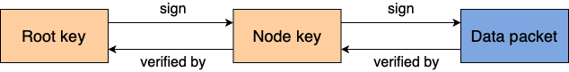
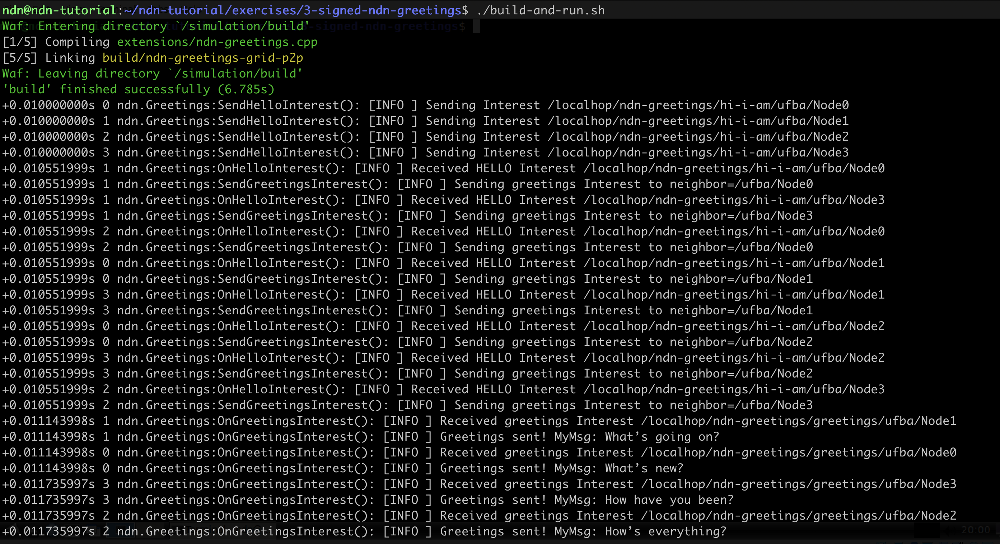
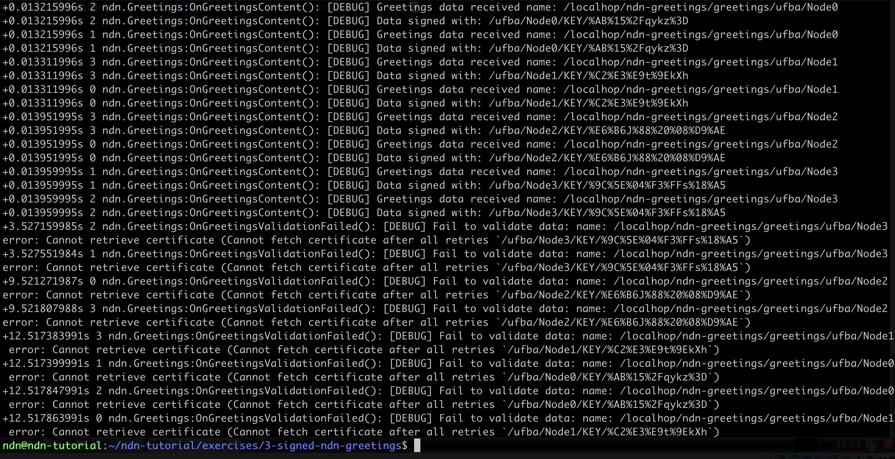
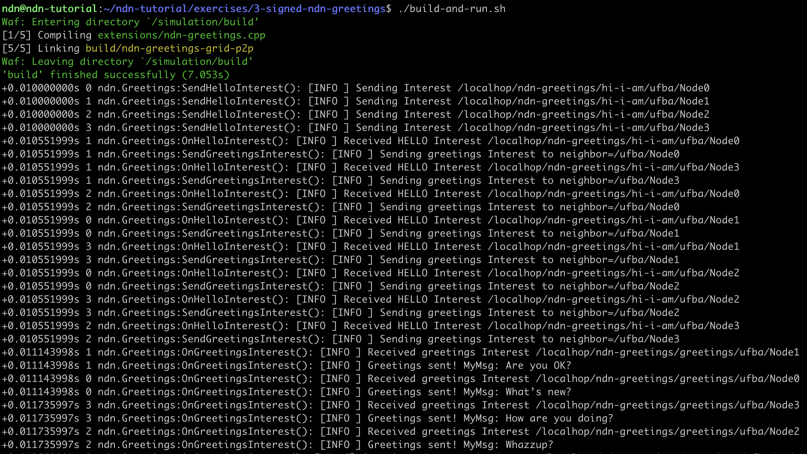
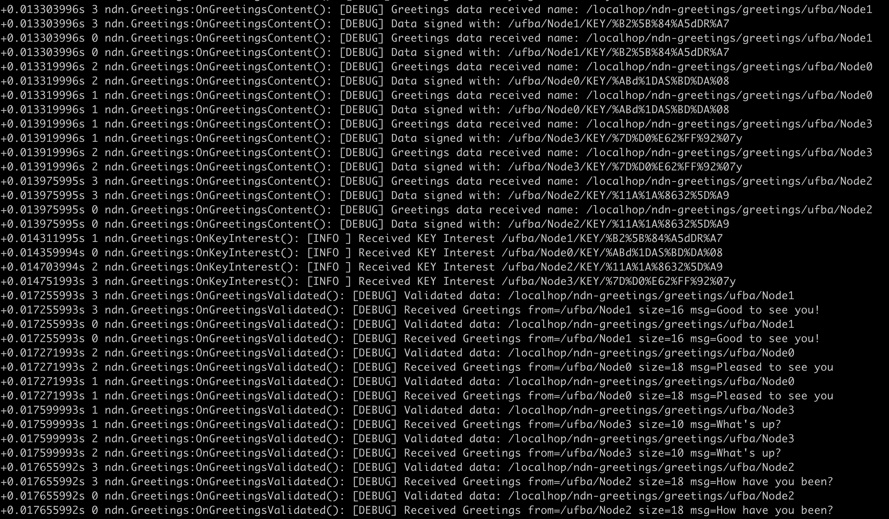

# NDN-Greetings: Secure/Signed NDN Application

## Introduction

In this exercise, we will continue working on the [NDN Greetins](../2-ndn-greetings)
application, and now we will add the proper security validations. By adding
security we mean: signing and verifying all data packets to ensure integrity
and authenticy.

Our security model for signing and verifying data packets is based on the
following diagram:



In the above diagram, the Root key will sign the Node key, and the Node key
will sign the actual NDN Greetings data packates. The Root key is our Trust
Anchor, thus it is supposed to be pre-installed in every node. Each data
packate will be signed by its corresponding Node key, and the key name
will be listed in the KeyLocator data packet field. Once a node receives
a data packet, it will retrieve the correspondent key, validate if that key
is allowed to sign such data packets, and validate the key itself. During
this exercise we will develop the code for all those steps. 

Let's get started!

> **Spoiler alert:** There is a reference solution in the `solution`
> sub-directory. Feel free to compare your implementation to the
> reference.

## Step 1: Loading the Data Validator Config

0. In your shell, make sure you are at the exercise folder:
   ```bash
   cd ~/ndn-tutorial/exercises/3-signed-ndn-greetings
   ```
1. The first step we need to do is create the validation config. To do so,
   create the file `config/validation.conf` with the following content:
   ```
   rule
   {
     id "Greetings Messages should be signed by Node's key"
     for data
     filter
     {
       type name
       regex ^<localhop><ndn-greetings><greetings><>*$
     }
     checker
     {
       type customized
       sig-type rsa-sha256
       key-locator
       {
         type name
         hyper-relation
         {
           k-regex ^([^<KEY>]*)<KEY><>$
           k-expand \\1
           h-relation equal
           p-regex ^<localhop><ndn-greetings><greetings>(<>*)$
           p-expand \\1
         }
       }
     }
   }
   rule
   {
     id "Node's certificate should be signed by root key"
     for data
     filter
     {
       type name
       regex ^([^<KEY>]*)<KEY><><><>$
     }
     checker
     {
       type customized
       sig-type rsa-sha256
       key-locator
       {
         type name
   
         regex ^<ndn-greetings><KEY><>$
       }
     }
   }
   trust-anchor
   {
     type file
     file-name "../build/rootCert.crt"
   }
   ```
   The validation config has three rules:
   - The first rule will make sure that Greetings data package will be
     signed by the correspondent Node key, i.e., only Node `/ufba/NodeA`
     (which has a key named `/ufba/NodeA/KEY/<key-id>`)can send Greetings
     data packets named `/localhop/ndn-greetings/greetings/ufba/NodeA`.
   - The second rule will make sure that Node's key is signed by the Root
     key. The Node's key is used to verify the Data key signature.
   - The third rule defines our Trusted Anchor, which verifies the Node
     key signature.

2. Edit the file `extensions/ndn-greetings.cpp` and look for *TODO 1*. Right
   after the TODO comment, you should insert the code to load the validation
   rules:
   ```cpp
     /* Load validation rules (XXX: it should be a parameter)*/
     std::string fileName = "./config/validation.conf";
     try {
       m_validator.load(fileName);
     }
     catch (const std::exception &e ) {
       throw std::runtime_error("Failed to load validation rules file=" + fileName + " Error=" + e.what());
     }
   ``` 

3. Start the container, compile and run the code to make sure everything
   is working so far:
   ```bash
   ./start-docker.sh
   ./compile.sh
   ./build-and-run.sh
   ```
   Important aspects to be observed:
   - You should notice that the greetings data packets are being sent, however
     the consumer is not doing anything with it (we will do in the next steps)
   - During the scenario setup process, the root certificate was created at
     `build/rootCert.crt`

## Step 2: Call validator upon receiving data packets

1. To call the validator upon receiving data packets, edit the file
   `extensions/ndn-greetings.cpp` and look for *TODO 2*. Right
   after the TODO comment, you should insert the following lines:
   ```cpp
     MYLOG_DEBUG("Greetings data received name: " << data.getName());
   
     /* Security validation */
     if (data.getSignature().hasKeyLocator()) {
       MYLOG_DEBUG("Data signed with: " << data.getSignature().getKeyLocator().getName());
     }
   
     // Validating data
     m_validator.validate(data,
                          std::bind(&NdnGreetings::OnGreetingsValidated, this, _1),
                          std::bind(&NdnGreetings::OnGreetingsValidationFailed, this, _1, _2));
   ```
   The code above is just displaying the key name from KeyLocator and calling
   the validator to validate the received data packet.

2. Build and run the application:
   ```bash
   ./build-and-run.sh
   ```
   The output should looks like:




You will notice the following error on the validator: `Fail to validate data: name: /localhop/ndn-greetings/greetings/ufba/Node3 error: Cannot retrieve certificate (Cannot fetch certificate after all retries /ufba/Node3/KEY/%9C%5E%04%F3%FFs%18%A5`
The error is happening because the node does not have the key used to
sign the data packet, and failed to fetch that key from the Network.
In the next step, we will solve this issue by adding the capability
of distributing the Key to our application.

## Step 3: Enable node Certificate distribution

1. As we saw in the previous section, in order to enable the complete
   validaiton process, the node should be able to retrieve the keys used
   to sign data packet. That means our application should also provide
   certificate distribution capabilities. To enable key distribution, edit
   the file `extensions/ndn-greetings.cpp` and look for *TODO 3*. Right
   after the TODO comment, you should insert the following lines:
   ```cpp
     /* Register the KEY prefix in the FIB so other can fetch our certificate */
     Name nodeKeyPrefix = Name(m_nodeName);
     nodeKeyPrefix.append("KEY");
     m_face.setInterestFilter(nodeKeyPrefix, std::bind(&NdnGreetings::OnKeyInterest, this, _2),
       [this](const Name&, const std::string& reason) {
         throw std::runtime_error("Failed to register sync interest prefix: " + reason);
     });
   ```
   The code above is just registering a new interest filter in the FIB, to be able
   to procede data related to the Node key.

2. Continue editing the file `extensions/ndn-greetings.cpp` and look for
   *TODO 4*. Right after the TODO comment, you should insert the following
   lines:
   ```cpp
     MYLOG_INFO("Received KEY Interest " << interest.getName());
     std::string nameStr = interest.getName().toUri();
     std::size_t pos = nameStr.find("/KEY/");
     ndn::Name identityName = ndn::Name(nameStr.substr(0, pos));
   
     try {
       // Create Data packet
       auto cert = m_keyChain.getPib().getIdentity(identityName).getKey(interest.getName()).getDefaultCertificate();
   
       // Return Data packet to the requester
       m_face.put(cert);
     }
     catch (const std::exception& ) {
       MYLOG_DEBUG("The certificate: " << interest.getName() << " does not exist! I was looking for Identity=" << identityName);
     }
   ```
   The lines above will reply to KEY interest by i) getting the prefix name
   from the interest packet, ii) loading the KeyChain to obtain the
   correspondent certificate and iii) sending out a data packet with the
   certificate.

3. Let's build and run our application:
   ```bash
   ./build-and-run.sh
   ```
   The output should looks like:




### Questions to discuss

- As we discussed earlier, our NDN application had to provide key distribution
  capabilities to allow the proper signature validation. How does this work on
  TCP/IP applications? Are they also suppose to provide key distribuition
  capabilities? What are the differences (if any)?
- When replying to interest packets, we usually sign the data using the KeyChain
  beforing sending it out. However, for the KEY interest, we didnt sign the data.
  Why was that?
- Is it safe to send the Key over the network? What are the risks?
- Since the signature is created at data producing time and the validation can
  happen later on, how to ensure the key will be available when validating
  (i.e., not revoked, replaced, etc.)?

## Next Steps

Congratulations, your implementation works!
